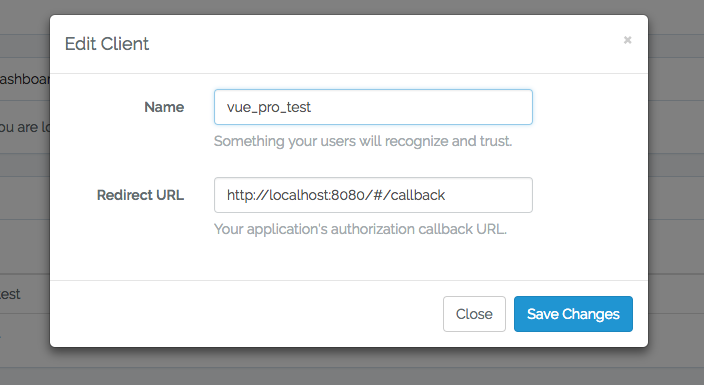
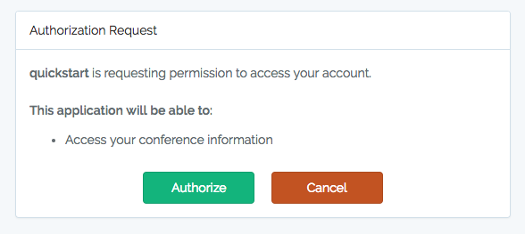

# Laravel5.4 安装Passport 支持

## A. 安装 Passport

### 1.新建 Laravel 项目
```
laravel new restful
```

### 2.修改 config/app.php 配置
将下面配置添加到 providers 里去
```
Laravel\Passport\PassportServiceProvider
```

### 3.运行下面的命令
```
php artisan migrate
php artisan passport:install
```

### 4.修改 User class, 导入 Laravel\Passport\HasApiTokens
```
<?php

namespace App;

use Laravel\Passport\HasApiTokens;
use Illuminate\Notifications\Notifiable;
use Illuminate\Foundation\Auth\User as Authenticatable;

class User extends Authenticatable
{
    use HasApiTokens, Notifiable;
...

```

### 5.添加 OAuth2 router 到 AuthServiceProvider 中, 并在 boot() 中运行 Passport::routers()
```
use Laravel\Passport\Passport;
```

```
// AuthServiceProvider
public function boot()
{
    $this->registerPolicies();
    Passport::routes();
    Passport::tokensCan([
        'conference' => 'Access your conference information'
    ]);
}
```

### 6.修改 config/auth.php , guards.api.driver;
```
return [
    ...
    'guards' => [
        ...
        'api' => [
            'driver' => 'passport', // was previously 'token'
            'provider' => 'users'
        ]
    ]
];
```

### 7.运行 make:auth, 生成用户登录注册系统
```
php artisan make:auth
```

### 8.加入Vue Components
```
php artisan vendor:publish --tag=passport-components
```

## B.启用 Passport Vue Components (可选)

### 1.在resources/assets/js/app.js 中加入以下配置
```
Vue.component(
    'passport-clients',
    require('./components/passport/Clients.vue')
);

Vue.component(
    'passport-authorized-clients',
    require('./components/passport/AuthorizedClients.vue')
);

Vue.component(
    'passport-personal-access-tokens',
    require('./components/passport/PersonalAccessTokens.vue')
);
```

### 2.安装node依赖
```
npm install
```

```
npm run dev
```
如果运行出错，则升级下npm，在运行上面的命令
```
npm install npm@latest -g
```

### 3.将下面组件插入到你要用到的页面中
```
<!-- let people make clients -->
<passport-clients></passport-clients>

<!-- list of clients people have authorized to access our account -->
<passport-authorized-clients></passport-authorized-clients>

<!-- make it simple to generate a token right in the UI to play with -->
<passport-personal-access-tokens></passport-personal-access-tokens>
```

如下图，将代码插入到home.blade.php中，可以看到


## C.测试API

### 1.创建一个客户端APP
```
http://localhost:8080 这里假设是本地的8080端口
```

### 2.创建 OAuth Clients



### 3.配置客户端路由
```
Route::get('authorize', function () {
    // Build the query parameter string to pass auth information to our request
    $query = http_build_query([
        'client_id' => 3,
        'redirect_uri' => 'http://localhost:8080/callback',
        'response_type' => 'code',
        'scope' => 'conference'
    ]);

    // Redirect the user to the OAuth authorization page
    return redirect('http://server.com/oauth/authorize?' . $query);
});

Route::get('callback', function (Request $request) {
    $http = new GuzzleHttp\Client;

    $response = $http->post('http://server.com/oauth/token', [
        'form_params' => [
            'grant_type' => 'authorization_code',
            'client_id' => 3, // from admin panel above
            'client_secret' => 'tawPTcxiQllBVAoFPqR20ONB12wv2BTOHZfmmrim', // from admin panel above
            'redirect_uri' => 'http://localhost:8080/callback',
            'code' => $request->code // Get code from the callback
        ]
    ]);

    echo $request->code;
    // echo the access token; normally we would save this in the DB
    // return json_decode((string) $response->getBody(), true)['access_token'];
});
```

### 4.开始测试
在浏览器中打开
```
http://localhost:8080/authorize
```
会跳转到server的授权页面



点击了Authorize 之后会跳转到 callback 页面， 并通过code获得access_token等信息

## D.解决 vue2.0 和 laravel 跨域

### 1.构建CORS响应域
```
php artisan make:middleware Cors
```

```
<?php

namespace App\Http\Middleware;

use Closure;

class Cors
{
    /**
     * Handle an incoming request.
     *
     * @param  \Illuminate\Http\Request  $request
     * @param  \Closure  $next
     * @return mixed
     */
    public function handle($request, Closure $next)
    {
        // 设置允许访问的域地址
        $domains = ['http://localhost:8080'];
        // 判断请求头中是否包含ORIGIN字段
        if(isset($request->server()['HTTP_ORIGIN'])){
            $origin = $request->server()['HTTP_ORIGIN'];
            if (in_array($origin, $domains)) {
                //设置响应头信息
                header('Access-Control-Allow-Origin: '.$origin);
                header('Access-Control-Allow-Headers: Origin, Content-Type, Authorization');
            }
        }

        return $next($request);
    }
}
```

### 2.修改 laravel_domain/app/Http/Kernel.php ，将 `\App\Http\Middleware\Cors::class` 添加到$middleware中
```
    protected $middleware = [
        \Illuminate\Foundation\Http\Middleware\CheckForMaintenanceMode::class,
        \Illuminate\Foundation\Http\Middleware\ValidatePostSize::class,
        \App\Http\Middleware\TrimStrings::class,
        \Illuminate\Foundation\Http\Middleware\ConvertEmptyStringsToNull::class,
        \App\Http\Middleware\Cors::class,
    ];
```

## E.用 vue resource 调用API 获取token

### 1.authorize 页面
```
<script>
export default {

    data () {
        return {}
    },
    mounted () {
        let paramData = []
        paramData.push('client_id=4')
        paramData.push('redirect_uri=' + window.encodeURIComponent(this._appConf.LOCAL_DOMAIN + '/#/callback'))
        paramData.push('response_type=code')
        paramData.push('scope=conference')

        let query = paramData.join('&')

        console.log(query)

        let apiUrl = this._appConf.TWS_RESTFUL_URL + '/oauth/authorize?' + query

        window.location.href = apiUrl
    }
}
</script>
```

### 2.callback 页面
```
<script>
export default {

    data () {
        return {}
    },
    methods: {
        getURLParams (name) {
            return decodeURIComponent((new RegExp('[?|&]' + name + '=' + '([^&;]+?)(&|#|;|$)').exec(window.location.href) || [''])[1].replace(/\+/g, '%20')) || null
        }
    },
    mounted () {
        let formData = new window.FormData()
        formData.append('grant_type', 'authorization_code')
        formData.append('client_id', 4)
        formData.append('client_secret', 'Hlu8llbeknEkB80YZ4gPGXx5WXAIItk1ctQ9I7Ut')
        formData.append('redirect_uri', this._appConf.LOCAL_DOMAIN + '/#/callback')
        formData.append('code', this.getURLParams('code'))

        // 发送POST请求，向认证服务器申请 token
        this.$http.post(this._appConf.TWS_RESTFUL_URL + '/oauth/token', formData, {emulateHTTP: true})
                .then(response => {
                    console.log(response.data)
                    if (response.status === 200) {
                        let oauthInfo = JSON.stringify(response.data)
                        window.localStorage.setItem('oauthInfo', oauthInfo)
                        window.location.href = this._appConf.LOCAL_DOMAIN
                    }
                })
    }
}
</script>
```

### 3.通过获取的 access_token 获取用户信息
```
<script>
export default {

    data () {
        return {
            user: {}
        }
    },
    methods: {

    },
    mounted () {
        let oauthInfo = JSON.parse(window.localStorage.getItem('oauthInfo'), true)

        let headers = {}
        headers.Authorization = 'Bearer ' + oauthInfo.access_token

        this.$http.get(this._appConf.TWS_RESTFUL_URL + '/api/user', { headers: headers })
            .then((response) => {
                console.log(response.data)
            }).catch(this.requestError)
    }
}
</script>
```

